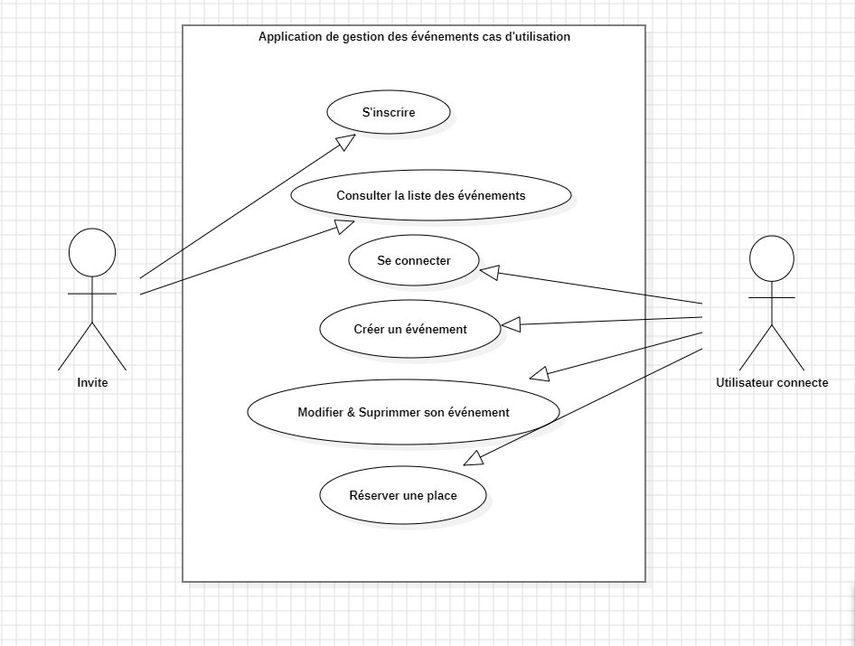

# 🎫 EventProjet – Application de gestion et réservation d’événements


---

## 📖 Sommaire

- [📚 Contexte et compréhension du domaine](#contexte-et-compréhension-du-domaine)
- [🧱 Choix d’architecture](#choix-darchitecture)
- [🧬 Principes appliqués (KISS, DDD, SOLID, TDD)](#principes-appliqués)
- [💾 Cluster MariaDB](#cluster-mariadb)
- [📊 Diagrammes UML](#diagrammes-uml)
- [🛠️ Installation & Lancement](#installation--lancement)

---

## 📚 Contexte et compréhension du domaine

EventProjet est une application de réservation de places pour des événements (concerts, conférences, expositions).

### Fonctionnalités principales :
- Inscription et connexion des utilisateurs
- Création et gestion d’événements
- Réservation de places en temps réel
- Suivi dynamique du taux de remplissage

🔁 **Contraintes métier clés** :
- Affichage en **temps réel** du nombre de places restantes
- Synchronisation entre utilisateurs en cas de réservation simultanée

---

## 🧱 Choix d’architecture

### 🧩 Architecture en couches

- **Frontend** : React + Bootstrap
- **Backend** : Node.js + Express (API REST)
- **Base de données** : MariaDB (cluster Galera)

### ✅ Justifications :

- Séparation claire des responsabilités (KISS, SOLID)
- Haute disponibilité via cluster Galera
- Architecture simple et évolutive, idéale pour un contexte pédagogique

### ⚠️ Limites :

- Pas de WebSocket : la mise à jour temps réel repose sur du polling REST
- Pas d’orchestration microservices : tout est dans un seul service backend

---

## 🧬 Principes appliqués

### 🔹 KISS
- Code simple, lisible, maintenable
- Une seule responsabilité par composant

### 🔹 Domain Driven Design (DDD)
- **Bounded Contexts** : utilisateurs, événements, réservations
- **Agrégats** : un événement regroupe ses réservations
- **Vocabulaire ubiquitaire** : “Utilisateur”, “Événement”, “Réservation”, etc.

### 🔹 Test Driven Development (TDD)
- Tests unitaires backend
- Tests d’acceptation utilisateur
- Tests de contrat (API)

### 🔹 SOLID
- Principes appliqués aux services backend (SRP, OCP, etc.)

---

## 💾 Cluster MariaDB

- Cluster multi-nœuds basé sur **Galera**
- Réplication synchrone
- Tests de tolérance aux pannes : arrêt d’un nœud, continuité assurée

📚 Une documentation complète est fournie pour :
- Lancer le cluster
- Migrer les données
- Vérifier la réplication

---


## 📊 Diagrammes UML

### 🧍 Diagramme de cas d’utilisation



> Illustre les interactions entre les rôles (invité, membre) et les fonctionnalités principales.

### 🧩 Diagramme de classes


> Montre les entités principales : Utilisateur, Événement, Réservation, et leurs relations.

---

## 🛠️ Installation & Lancement

### 🔁 1. Cloner le projet

```bash
git clone https://github.com/khaliljaouani/eventprojet.git
cd eventprojet

### 🖥️ 2. Installer et lancer le backend

cd backend
npm install
node server.js


### 🌐 3. Installer et lancer le frontend

cd ../frontend
npm install
npm start

 ### 💾 4. Importer la base de données
Ouvrir HeidiSQL ou phpMyAdmin

Créer une base eventdb

Importer le fichier database.sql fourni dans le dossier /db

### 📦 5. Installer les dépendances

npm install react-bootstrap bootstrap
